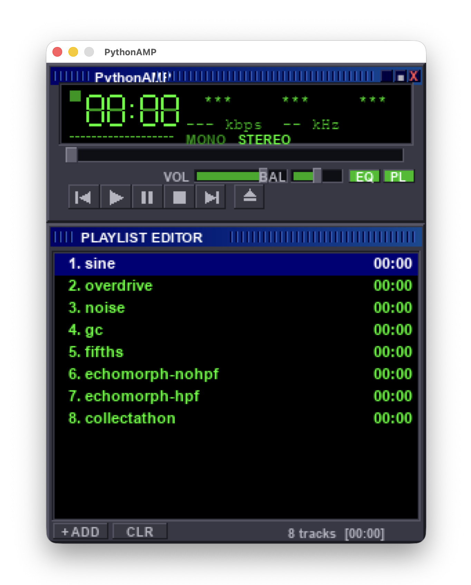

# PythonAmp Classic

A retro MP3 player in Python with a Winamp-inspired fixed-size GUI, playlist, seek bar, volume control, drag-and-drop support, and file-open dialog. The project uses `pygame-ce` for the custom desktop UI and `mutagen` for metadata.



## Install

```bash
python3 -m pip install -r requirements.txt
```

## Run

```bash
python3 main.py
```

## Controls

- `ADD` or `OPEN`: load audio files
- Double-click a playlist item: play it
- `Space`: pause or resume
- `Enter`: play selected track
- `Delete`: remove selected track
- Drag files into the window: add them to the playlist
